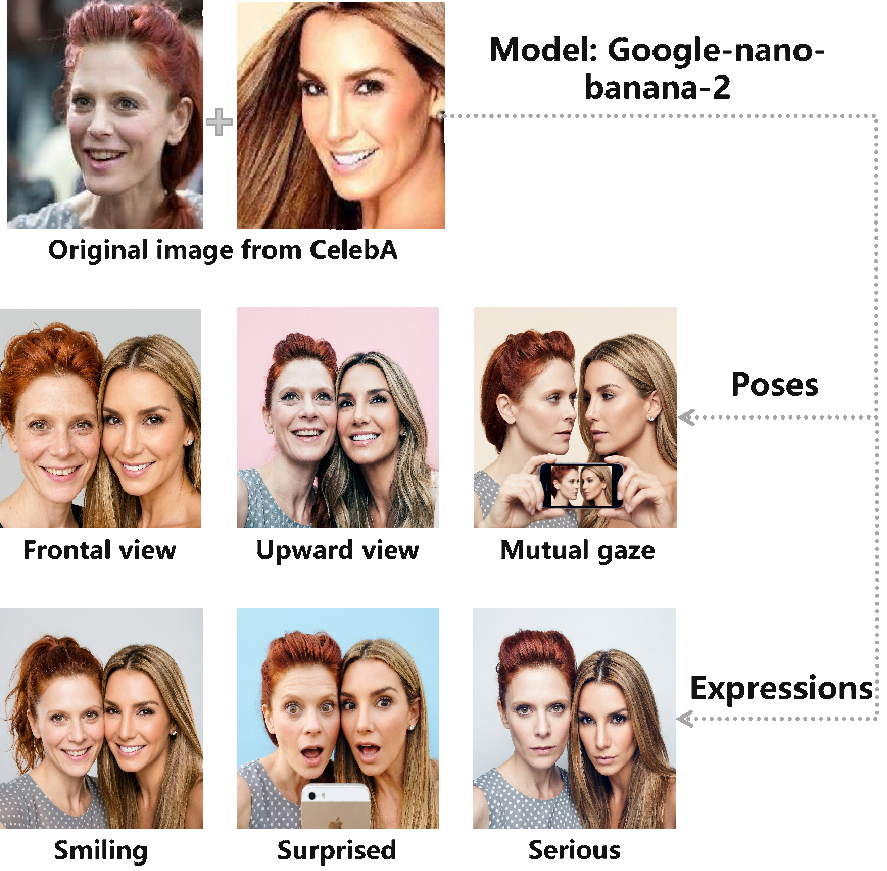
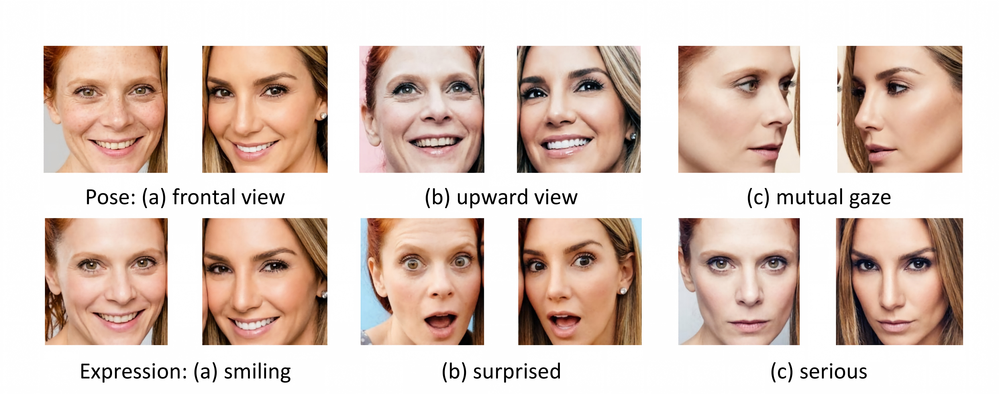

# DualFace-Forgery: A Benchmark Dataset for Dual-Face Collaborative Forgery Detection
This paper presents a comprehensive public benchmark dataset dedicated to dual-face collaborative deepfake detection. Training on this dataset yields substantial improvements in cross-scene detection performance and enables accurate attribution of forgery sources.
‌The DFFD dataset consists of dual-face forged group photos generated by multiple generative models, covering diverse poses and expressions. It is constructed through preprocessing operations including face alignment, separation, and size transformation, with the original face images sourced from the CelebA benchmark dataset.




# Get our DFFD dataset
 1. Download DFFD dataset

First click this link to download our DFFD dataset. You will need a password to unzip the downloaded dataset. Please follow the steps below to obtain the password.

1) Since DFFD is built upon CelebA, you should first obtain authorization from CelebA. After that, please include the email you received from CelebA in your email to us.

2) Our dataset also has a license, which you can read here: [License](LICENSE)
.

3) Please email Decheng Liu (dchliu@xidian.edu.cn) to obtain the password. We will respond as soon as possible. Please ensure that your email is sent from a valid official (University or Company) account and includes the following information:

```javascript
Subject: Application to download the DFFD
Name: (your first and last name)
Affiliation: (University or Company where you work)
Department: (your department)
Position: (your job title)
Email: (must be the email at the above mentioned institution)

I have read and agree to the terms and conditions specified in the DFFD license.
The email content responsed by CelebA in step1. 

